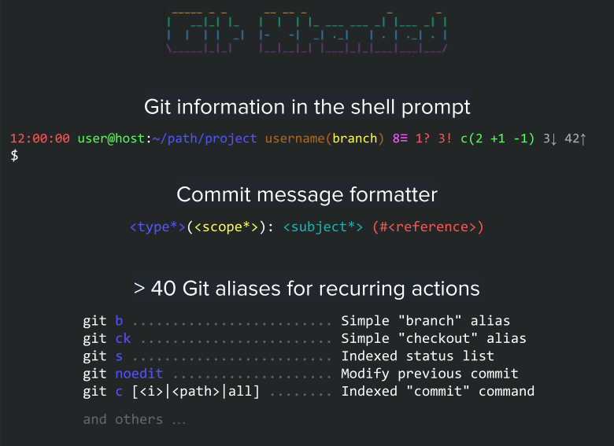

:GX_TITLE: Git Xtended
:GX_NAME: git-xtended
:GIT_PROJECT: https://github.com/jprivet-dev/{GX_NAME}

= {GX_TITLE}
:numbered:
:toc: macro

:toc-title: Summary
:toclevels: 3

image:https://app.codacy.com/project/badge/Grade/31960ec18f3d4134b92e9164255dee6e["Codacy code quality", link="https://www.codacy.com/gh/jprivet-dev/git-xtended/dashboard?utm_source=github.com&utm_medium=referral&utm_content=jprivet-dev/git-xtended&utm_campaign=Badge_Grade"]

toc::[]

== Presentation

*{GX_TITLE}* is a shell tool that makes it easy to perform recurring actions with *Git* on a daily basis.

It allows :

* Display in the *shell prompt* the project status with *Git information*.
* Set up *documented aliases* for recurring *Git* actions.
* Have a *commit message formatter* (without `prepare-commit-msg` hook) inspired by the https://www.conventionalcommits.org/[conventional commits].
* Provide comprehensive and quickly accessible *documentation in the shell*.
* Customise *options globally or by project*.
* Ensure stability with *unit tests*.

[TIP]
====
*{GX_TITLE}* does not alter the default operation of *Git* commands: all *Git* commands retain their original behaviour.
====

The features of *{GX_TITLE}* are based on my experiments with hundreds of aliases, which you can find on my Gist https://gist.github.com/jprivet-dev/09912ca4188a4ba3c610d7f61c200c38[Git and Bash aliases defined and documented in a single `.bash_aliases` file, with Git auto-completion].

== A short demo

image::doc/img/gx-c-demo.gif[]

== Documentation

Find all the information on installation and configuration in the *{GX_TITLE}* documentation on https://www.jprivet.dev/git-xtended.

== Comments, suggestions?

Feel free to make comments/suggestions to me in the {GIT_PROJECT}/issues[Git issues section].

== License

*{GX_TITLE}* is released under the {GIT_PROJECT}/blob/main/LICENSE[*MIT License*]