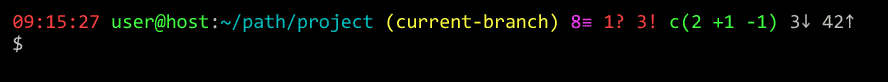

:numbered:
:toc: macro
:sectanchors:

:VERSION: 0.0.0-beta-1
:MAIN_TITLE: Git Xtended
:MAIN_TITLE_SHORT: GX

:BACK_TO_TOP_TARGET: git-xtended
:BACK_TO_TOP_LABEL: ⬆ Back to top
:BACK_TO_TOP: <<{BACK_TO_TOP_TARGET},{BACK_TO_TOP_LABEL}>>

:BASHRC_PATH: ~/.bashrc
:BASH_PROFILE_PATH: ~/.bash_profile

:GX_ROOT: ~/git-xtended
:GX_ENTRY_FILE: gx.sh
:GX_ENTRY_FILE_PATH: {GX_ROOT}/{GX_ENTRY_FILE}

:GIT_PROJECT: https://github.com/jprivet-dev/git-xtended
:GIT_CLONE_PROJECT: git@github.com:jprivet-dev/git-xtended.git

:PROMPT_PS1: 09:15:27 user@host:~/path/project username(branch) 8≡ 1? 3! c(2 +1 -1) 3↓ 42↑
:PROMPT_PS1_ERRORS: 09:15:27 user@host:~/path/project username(branch) 8≡ 1? 3! c(2 +1 -1) x↓ x↑
:PROMPT_PS1_NO_CHANGE: 09:15:27 user@host:~/path/project username(branch) 0↓ 10↑

[#{BACK_TO_TOP_TARGET}]
= {MAIN_TITLE} ({VERSION})

image:https://api.codacy.com/project/badge/Grade/31960ec18f3d4134b92e9164255dee6e["Codacy code quality", link="https://www.codacy.com/app/jprivet-dev/git-xtended?utm_source=github.com&utm_medium=referral&utm_content=jprivet-dev/git-xtended&utm_campaign=Badge_Grade"]

'''

:toc-title: Table of contents
:toclevels: 3
toc::[]

'''

== Presentation

**{MAIN_TITLE}** brings together in a single entity my various "facilities" developed in recent years to exploit Git more quickly.

It facilitates **recurring Git actions in shell**:

. Project status display with main **Git information in prompt**
. **Aliases** of recurring Git commands
. **Formatted commit message** (without `prepare-commit-msg` hook)

{BACK_TO_TOP}

== Roadmap & Public Beta Version

**{MAIN_TITLE}** has recently been released (June 2018) in **public beta version**.

This means that during the next semester, this version will be tested and stabilized with some beta testers :P (Thank you!).

Comments, suggestions? Feel free to make them to me in the {GIT_PROJECT}/issues[Git issues section of that project] :)

{BACK_TO_TOP}

== Installation in 4 steps

*STEP 1 : Clone the project*

[subs=attributes+]
----
$ cd
$ git clone {GIT_CLONE_PROJECT}
----

*STEP 2 : Import `{GX_ENTRY_FILE}`*

Copy the following code at the end of your file `{BASHRC_PATH}` (or in `{BASH_PROFILE_PATH}`):

[subs=attributes+]
----
# If the file `{GX_ENTRY_FILE}` exists, then load it
[[ -f {GX_ENTRY_FILE_PATH} ]] && source {GX_ENTRY_FILE_PATH}
----

*STEP 3 : Reload `{BASHRC_PATH}` (or `{BASH_PROFILE_PATH}`). Avoid logout and back to the shell*

[subs=attributes+]
----
$ . {BASHRC_PATH}

 _____ _ _      __ __ _             _       _
|   __|_| |_   |  |  | |_ ___ ___ _| |___ _| |
|  |  | |  _|  |-   -|  _| ._|   | . | ._| . |
|_____|_|_|    |__|__|_| |___|_|_|___|___|___|

                                        v0.0.0
----------------------------------------------
Prompt with Git information           Disabled
Git aliases                           Disabled
----------------------------------------------
- {GIT_PROJECT} -
----------------------------------------------
----

*STEP 4 : Activate the {MAIN_TITLE} options you want*

[subs=attributes+]
----
$ gx install

{MAIN_TITLE} install (Global configuration)

> Prompt with Git information  [0] Disabled  [1] Enabled : 1
> Prompt with Git information = Enabled
> Remote branch reference : origin/dev
> Remote branch reference = origin/dev
> Git aliases  [0] Disabled  [1] Enabled : 1
> Git aliases = Enabled
----

After installation, you will be able to see the **{MAIN_TITLE}** parameters in the global Git `.config` file:

----
[gx]
	prompt-status = Enabled
	remote-branch-ref = origin/dev
	gitaliases-status = Enabled
[alias]
    ...
----

You can also print the `gx` configuration in shell:

----
$ gx config
gx.prompt-status=Enabled
gx.remote-branch-ref=origin/dev
gx.gitaliases-status=Enabled
----

You can see the whole git configuration (Global & Local):

----
$ git config --list
----

{BACK_TO_TOP}

== Update {MAIN_TITLE}

[subs=attributes+]
----
$ cd {GX_ROOT}
$ git pull origin master
$ gx reload
----

{BACK_TO_TOP}

== Features overview

=== Prompt with Git information

**{MAIN_TITLE}** changes the prompt (`PS1`) and adds information about Git:

[subs=attributes+]
----
{PROMPT_PS1}
$ gx help

  # Prompt with Git information :
    username(branch) ... Current Git username & branch
    8≡ ................. All elements from git status
    1? ................. Untracked files
    3! ................. Changes not staged for commit
    c(2 +1 -1) ......... Changes to be committed
    3↓ ................. Commits behind remote branch reference (origin/dev)
    42↑ ................ Commits ahead remote branch reference (origin/dev)
----

==== Prompt : `remote branch reference` configuration

The `remote branch reference` is configured at installation (`$ gx install`), in a global way:

----
$ gx config
gx.prompt-status=Enabled
gx.remote-branch-ref=origin/dev
gx.gitaliases-status=Enabled
----

You can configure a `remote branch reference` per Git repository:

----
$ git config gx.remote-branch-ref origin/myremotebranch
----

----
$ gx config
gx.prompt-status=Enabled
gx.remote-branch-ref=origin/dev             <== global config
gx.gitaliases-status=Enabled
gx.remote-branch-ref=origin/myremotebranch  <== local config
----

If necessary, delete the local configuration:

----
$ git config --unset gx.remote-branch-ref
----

----
$ gx config
gx.prompt-status=Enabled
gx.remote-branch-ref=origin/dev             <== global config
gx.gitaliases-status=Enabled
----

==== Prompt : `remote branch reference` troubleshooting (x↓ x↑)

Sometimes, instead of having numbers (ex: `0↓ 42↑`), you will  see in the prompt `x↓ x↑` in red:

[subs=attributes+]
----
{PROMPT_PS1_ERRORS}
----

This means that the `remote branch reference` is not correct.
**Check that the remote branch of your repository is really existing.**

{BACK_TO_TOP}

=== Git aliases

==== Find 21 aliases at your disposal

----
$ gx help

  # Git aliases :
         log | git l .................... Show the last 12 commit logs (graphical representation)
               git ll ................... Show all commit logs (graphical representation)
               git lfile <file> ......... Show all commit logs for a specific file (graphical representation)
               git lmerges .............. Show all merge logs (graphical representation)
               git lcount ............... Number of commits per author
      branch | git b .................... Simple "branch" alias
    checkout | git cancel [<i>|<path>] .. Extended "checkout" alias (select file with index status instead of path)
      status | git s .................... Indexed status list (staged, unstaged, and untracked files)
               git ss ................... Simple "status" alias
        diff | git d [<i>|<path>] ....... Extended "diff" alias (select file with index status instead of path)
         add | git a [<i>|<path>] ....... Extended "add" alias (select file with index status instead of path)
               git all .................. Add all files (new, modified and deleted)
               git nm ................... Add new and modified files, without deleted
               git md ................... Add modified and deleted files, without new
      commit | git c [<i>|<path>|all] ... Extended "commit" alias (select file with index status instead of path)
               git amend ................ Oops level 1! Modify the last commit
       reset | git r .................... Simple "reset" alias
               git hard [<commit>] ...... Simple "reset --hard" alias (by default, discard any changes to tracked files, since last commit)
               git undo ................. Oops level 2! Undo the last commit, while keeping files changes
       clean | git untracked ............ Remove all untracked files
        grep | git find <string> ........ Look for specified strings in the tracked files (case sensitive)
----

==== `git c` : commits are documentation

**{MAIN_TITLE}** proposes a **commit message formatting system** (without `prepare-commit-msg` hook):

----
$ git c
> git add (1) README.adoc
> & commit ...
--------------------------------------------------
M  README.adoc
--------------------------------------------------
user.name  : username
user.email : user@gmail.com
--------------------------------------------------
MSG = <type*>.<subtype>(<scope*>): <subject*>
--------------------------------------------------

<type*>
 archi ...... Changes application architecture (folder position, name, ...)
 conf ....... Changes configuration, parameters (config.yml, .gitignore, .gitkeep, ...)
 content .... Changes wording or images in contents
 chore ...... Changes to the build process or auxiliary tools and libraries (Gulp, Composer, ...)
 dev ........ Changes main code (creation, enhancement, evolution, ...)
 docs ....... Documentation only changes
 integ ...... Web integration, UX works - doesn't touch business logic (css, js, ...)
 install .... Install or update project, modules, pluggins (ex: composer install ...)
 tpl ........ Templating works (Twig, Drupal templating, Smarty, ...)
 trans ...... Adds locale-specific components, translates text, ...

<subtype>
 clean ...... Remove pointless code or files
 debug ...... Adding code for debugging (console.log, dpm, var_dump, ...), to remove later!
 fix ........ Bug fix
 generate ... Auto-generate code (Doctrine, PhoneGap, Ionic, ...)
 perf ....... A code change that improves performance
 refactor ... A code change that neither fixes a bug nor adds a feature
 style ...... Changes that do not affect the meaning of the code (white-space, formatting, missing semi-colons, ...)

--------------------------------------------------
<type*>.<subtype> <<< do|
----

First, you will have to choose a **type** (mandatory) and a **subtype** (not mandatory).
To do so, type the corresponding **shortcuts indicated in color and underlined** in shell (and unfortunately not in Github in this adoc file!).
For example:

----
do      => docs(...)
d f     => dev.fix(...)
i       => integ(...)
t r     => tpl.refactor(...)
...
----

After **choosing the type and subtype**, you will have to **choose the scope**.
It will be suggested to you **the names of files in progress**.
You will be able to modify it scope with your suitability (**To keep the suggestion**, simply tap **Enter**):

----
--------------------------------------------------
docs(<scope*>) <<< [README.adoc] |
----

Then, indicate the **subject**:

----
--------------------------------------------------
docs(README.adoc): <subject*> <<< update licence section|
----

And tap **Enter**:

[subs=attributes+]
----
--------------------------------------------------
docs(README.adoc): update licence section
--------------------------------------------------

[70-gx-config-enhancement dd0a2c4] docs(README.adoc): update licence section
 1 file changed, 1 insertion(+), 1 deletion(-)
{PROMPT_PS1_NO_CHANGE}
$
----

Your changes have been saved!

{BACK_TO_TOP}

=== {MAIN_TITLE} commands

----
$ gx help

  # GX commands :
    gx help ............ Display help information about GX
    gx install ......... Select and install GX elements
    gx reload .......... Reload GX
    gx status .......... Show status of GX elements
    gx config .......... Show GX git configuration
    gx colors .......... Show all GX colors
    gx test [<func>] ... Run one or all GX tests
----

{BACK_TO_TOP}

== Tips

=== Use index instead of name

For example, `$ git s` is an indexed version of `$ git status`:

----
$ git s
1)  M path/to/my/file1.sh
2)  M path/to/my/file2.sh
3)  M path/to/my/file3.sh
----

Instead of specifying the name of the file you want to commit, just *specify the index*:

----
$ git c 2
> git add (2) path/to/my/file2.sh
> & commit ...

--------------------------------------------------
 M path/to/my/file1.sh
M  path/to/my/file2.sh
 M path/to/my/file3.sh
--------------------------------------------------

# Then follow the steps of the formatted commit message
----

If you specify *no index*, the *first file* will be chosen by default:

----
$ git c
> git add (1) path/to/my/file1.sh
> & commit ...

--------------------------------------------------
M  path/to/my/file1.sh
 M path/to/my/file2.sh
 M path/to/my/file3.sh
--------------------------------------------------

# Then follow the steps of the formatted commit message
----

However, if you have already added files, there will be no default addition. Example:

----
$ git add path/to/my/file3.sh
$ git c
> & commit ...

--------------------------------------------------
 M path/to/my/file1.sh
 M path/to/my/file2.sh
M  path/to/my/file3.sh
--------------------------------------------------

# Then follow the steps of the formatted commit message
----

You can also specify *multiple indexes*:

----
$ git c 1 3
> git add (1) path/to/my/file1.sh
> git add (3) path/to/my/file3.sh
> & commit ...

--------------------------------------------------
M  path/to/my/file1.sh
 M path/to/my/file2.sh
M  path/to/my/file3.sh
--------------------------------------------------

# Then follow the steps of the formatted commit message
----

{BACK_TO_TOP}

=== Customization : override default settings

you can **override all variables** from parameter files `params.xxx.sh` in the folder `{GX_ROOT}/params/default/`.

[subs=attributes+]
----
.
`-- {GX_ROOT}/
    |-- doc/
    |-- params/
    |   |-- default/
    |   |   |-- params.colors.sh        |
    |   |   |-- params.default.sh       |
    |   |   |-- params.git.sh           | OVERLOADABLE
    |   |   |-- params.install.sh       | PARAMETERS
    |   |   |-- params.prompt.sh        |
    |   |   |-- params.sh               |
    |   |   `-- params.version.sh       |
    |   `-- test/
    |-- src/
    |-- tests/
    |-- .gitignore
    |-- gx.sh
    |-- gx.tests.sh
    |-- LICENSE
    `-- params.sh.dist
----

To do this, duplicate the following parameters file:

[subs=attributes+]
----
$ cp {GX_ROOT}/params.sh.dist {GX_ROOT}/params.sh
----

And copy in `{GX_ROOT}/params.sh` the variables you want to change.

WARNING: For the moment this overload system is not complete. Work is still in progress :)

==== Override Git aliases labels

.{GX_ROOT}/params.sh
----
GX_PARAMS_GIT_ALIAS_L="lg"        # instead of "l"
GX_PARAMS_GIT_ALIAS_UNTRACKED="u" # instead of "untracked"
----

To take into account its overloads, you will have to reload **{MAIN_TITLE}**:

----
$ gx reload
----

----
$ gx
    Git aliases :
         log | git lg ................... Show the last 12 commit logs (graphical representation)
       clean | git u .................... Remove all untracked files
----

==== Override types & subtypes of Git commit message formatting system

(TODO)

.{GX_ROOT}/params.sh
----
GX_PARAMS_GIT_ALIAS_L="lg"
...
----

To take into account its overloads, you will have to reload **{MAIN_TITLE}**:

----
$ gx reload
----

----
$ gx c
...
----

{BACK_TO_TOP}

== Code quality & Tests

=== Codacy & ShellCheck

**{MAIN_TITLE}** is analyzed by **Codacy**.

**Codacy** (https://www.codacy.com/) is an automated code analysis/quality tool that helps developers ship better software, faster.
**Codacy** uses **ShellCheck** (https://github.com/koalaman/shellcheck), a GPLv3 tool that gives warnings and suggestions for **bash/sh shell scripts**.

https://app.codacy.com/project/jprivet-dev/git-xtended/dashboard[See the {MAIN_TITLE} dashboard in Codacy].

=== Functional & Unit tests

**{MAIN_TITLE}** uses an **internal system of functional and unit tests** to verify the stability of developments.

[subs=attributes+]
----
.
`-- {GX_ROOT}/
    |-- doc/
    |-- params/
    |-- src/
    |-- tests/
    |   |-- colors.tests.sh         |
    |   |-- commands.tests.sh       |
    |   |-- git.tests.sh            | FUNCTIONAL AND
    |   |-- prompt.tests.sh         | UNIT TESTS
    |   |-- test.tests.sh           |
    |   `-- utils.tests.sh          |
    |-- .gitignore
    |-- gx.sh
    |-- gx.tests.sh
    |-- LICENSE
    `-- params.sh.dist
----

----
$ gx test

Git Xtended testing

>  Would you like to run the tests ? [y/n] y

--- Functions with test ---

[x]  gx_colors_print_all
[ ]  gx_command_action_aliases
...
[ ]  gx_symlink_exists
[x]  gx_trim

--- Launch all tests ---

# test_gx_colors_print_all +
# test_gx_command_help +++
...
# test_gx_test_fake_git ++
# test_gx_trim ++++++++

OK: 65 tests, 234 assertions, 0 failure

----

{BACK_TO_TOP}

== Ressources & Inspiration

. http://reinh.com/blog/2009/03/02/a-git-workflow-for-agile-teams.html
. http://www.jarrodspillers.com/git/2009/08/19/git-merge-vs-git-rebase-avoiding-rebase-hell.html
. https://bitbucket.org/durdn/cfg/src/master/.gitconfig?fileviewer=file-view-default
. https://developer.atlassian.com/blog/2015/10/monorepos-in-git/
. https://explainshell.com
. https://fr.atlassian.com/git/tutorials/rewriting-history
. https://gist.github.com/aemonge/9e60332c6a3e7147ee8e
. https://gist.github.com/stephenparish/9941e89d80e2bc58a153
. https://git-scm.com
. https://git-scm.com/book/en/v2/Git-Branching-Rebasing
. https://git-scm.com/book/fr/v1/Git-distribu%C3%A9-Contribution-%C3%A0-un-projet
. https://github.com/ahmadawais/hacktoberfest
. https://github.com/alebcay/awesome-shell
. https://github.com/angular/angular.js/blob/master/CONTRIBUTING.md
. https://github.com/angular/angular.js/blob/master/DEVELOPERS.md#-git-commit-guidelines
. https://github.com/nojhan/liquidprompt
. https://jondavidjohn.com/git-aliases-parameters/
. https://nvie.com/posts/a-successful-git-branching-model/
. https://raw.githubusercontent.com/arslanbilal/git-cheat-sheet/master/Img/git-flow-commands-without-flow.png
. https://stackoverflow.com/questions/20433867/git-ahead-behind-info-between-master-and-branch
. https://stackoverflow.com/questions/3258243/check-if-pull-needed-in-git
. https://stackoverflow.com/questions/572549/difference-between-git-add-a-and-git-add
. https://www.atlassian.com/agile/software-development/git-branching-video
. https://www.atlassian.com/blog/git/advanced-git-aliases
. https://www.atlassian.com/blog/git/git-automatic-merges-with-server-side-hooks-for-the-win

{BACK_TO_TOP}

== License

**{MAIN_TITLE}** is released under the **MIT License**

{GIT_PROJECT}/blob/master/LICENSE

'''

{BACK_TO_TOP}

