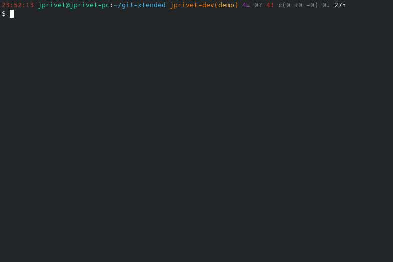

:GX_TITLE: Git Xtended
:GX_NAME: git-xtended
:GIT_PROJECT: https://github.com/jprivet-dev/{GX_NAME}

= {GX_TITLE}

image:https://app.codacy.com/project/badge/Grade/31960ec18f3d4134b92e9164255dee6e["Codacy code quality", link="https://www.codacy.com/gh/jprivet-dev/git-xtended/dashboard?utm_source=github.com&utm_medium=referral&utm_content=jprivet-dev/git-xtended&utm_campaign=Badge_Grade"]

== Presentation

*{GX_TITLE}* is a shell tool that makes it easy to perform recurring actions with *Git* on a daily basis.

It allows :

* Display in the *shell prompt* the project status with *Git information*.
* Set up *documented aliases* for recurring Git actions.
* Have a *commit message formatter* (without `prepare-commit-msg` hook) based on https://www.conventionalcommits.org/[conventional commits].
* Provide comprehensive and quickly accessible *documentation in the shell*.
* Customise *options globally or by project*.
* Ensure stability with *unit tests*.

== Demo

== Documentation

Find all the information on installation and configuration in the https://www.jprivet.dev/git-xtended[*{GX_TITLE}* documentation] (coming soon !!!).

== License

*{GX_TITLE}* is released under the {GIT_PROJECT}/blob/main/LICENSE[*MIT License*]