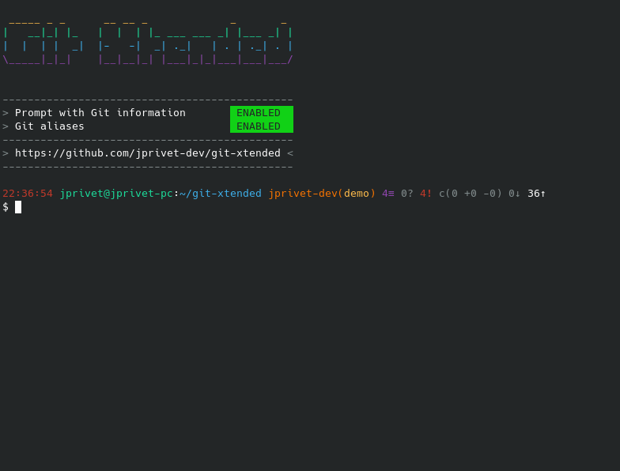

:GX_TITLE: Git Xtended
:GX_NAME: git-xtended
:BASHRC_PATH: ~/.bashrc
:BASH_PROFILE_PATH: ~/.bash_profile
:GX_ROOT: ~/{GX_NAME}
:GX_ENTRY_FILE: gx.sh
:GX_ENTRY_FILE_PATH: {GX_ROOT}/{GX_ENTRY_FILE}
:GIT_PROJECT: https://github.com/jprivet-dev/{GX_NAME}
:GIT_CLONE_PROJECT: git@github.com:jprivet-dev/{GX_NAME}.git
:CMD_GIT_CLONE: git clone --depth 1 --config core.autocrlf=false {GIT_CLONE_PROJECT}
:LAST_RELEASE: v1.4.0

:BACK_TO_TOP_TARGET: git-xtended
:BACK_TO_TOP_LABEL: ⬆ Back to top
:BACK_TO_TOP: <<{BACK_TO_TOP_TARGET},{BACK_TO_TOP_LABEL}>>

[#{BACK_TO_TOP_TARGET}]
= {GX_TITLE}
:numbered:
:toc: macro

:toc-title: Summary
:toclevels: 3

image:https://badgen.net/badge/release/{LAST_RELEASE}/blue[Project release,link={GIT_PROJECT}/releases/tag/{LAST_RELEASE}]
image:https://app.codacy.com/project/badge/Grade/b1673a9d232c48ac9f3ce4de2419022f["Codacy code quality", link="https://www.codacy.com/gh/jprivet-dev/git-xtended/dashboard?utm_source=github.com&utm_medium=referral&utm_content=jprivet-dev/git-xtended&utm_campaign=Badge_Grade"]

toc::[]

|===
| Last release | https://github.com/jprivet-dev/git-xtended/releases/tag/{LAST_RELEASE}[{LAST_RELEASE}]
| Documentation | https://www.jprivet.dev/git-xtended
|===

== Presentation

{GX_TITLE} is a shell tool that makes it easy to perform recurring actions with Git on a daily basis.



It allows :

* Display in the *shell prompt* the project status with *Git information*.
* Set up *documented Git & Bash aliases* for recurring actions.
* Have a *commit message formatter* (without `prepare-commit-msg` hook) inspired by the https://www.conventionalcommits.org/[conventional commits].
* Provide comprehensive and quickly accessible *documentation in the shell*.
* Customise *options globally or by project*.
* Ensure stability with *unit tests*.

[TIP]
====
{GX_TITLE} does not alter the default operation of Git commands: all Git commands retain their original behaviour.
====

The features of {GX_TITLE} are based on my experiments with hundreds of aliases, which you can find on my Gist https://gist.github.com/jprivet-dev/09912ca4188a4ba3c610d7f61c200c38[Git and Bash aliases defined and documented in a single `.bash_aliases` file, with Git auto-completion].

== Documentation

All on https://www.jprivet.dev/git-xtended[Git Xtended Documentation].

== Installation

All on https://www.jprivet.dev/git-xtended/#installation[Git Xtended Documentation - Installation]

== Overview

=== GX Help

```
$ gx
```

=== Prompt with Git information

```
12:00:00 user@host:~/path/project username(branch) 8≡ 1? 3! c(2 +1 -1) 3↓ 42↑ ⚠️️
```

```
$ gx prompt

  # Prompt with Git information :
    username(branch) ... Current Git username & branch
    8≡ ................. All elements from git status
    1? ................. Untracked files
    3! ................. Changes not staged for commit
    c(2 +1 -1) ......... Changes to be committed - c(modified added deleted)
    3↓ ................. Commits behind remote reference branch (origin/main)
    42↑ ................ Commits ahead remote reference branch (origin/main)
    ⚠️️   ................ To many commits behind or to many changes
```

NOTE: More information on https://www.jprivet.dev/git-xtended/#prompt-with-git-information[Git Xtended Documentation - Prompt with Git information]

=== Git aliases

```
$ gx galiases

  # Git aliases :
             log | git l ........................... Show the last 12 commit logs (graphical representation)
                   git ll .......................... Show all commit logs (graphical representation)
                   git lfile <file> ................ Show all commit logs for a specific file (graphical representation)
                   git lmerges ..................... Show all merge logs (graphical representation)
                   git lcount ...................... Number of commits per author
          branch | git b ........................... Simple "branch" alias
                   git recent ...................... Show all local branches ordered by recent commits
                   git previous .................... Quickly switch to the previous branch
                   git new <branch> [<remote>/<b>] . Create and switch on new branch
                   git rename [<branch>] <name> .... Rename one local branch
                   git delete <branch> ............. Delete local branch
                   git deletef <branch> ............ Forcefully delete local branch
                   git deleter <remote> <branch> ... Delete remote branch
        checkout | git ck .......................... Simple "checkout" alias
                   git res [<i>|<path>] ............ Indexed "restore" command (select file with index status instead of path)
                   git sw .......................... Simple "switch" alias
          status | git s ........................... Indexed status list (staged, unstaged, and untracked files)
                   git ss .......................... Simple "status" alias
            diff | git d [<i>|<path>] .............. Indexed "diff" command (select file with index status instead of path)
                   git dd .......................... Simple "diff" alias
                   git dw [<path>] ................. Show changes (ignore whitespace / word diff / without [-...-]{+...+})
                   git ds [<path>] ................. Show changes staged for commit
                   git dsw [<path>] ................ Show changes staged for commit, like 'dw'
                   git oneday ...................... Show changes over the last 24 hours
             add | git a [<i>|<path>] .............. Indexed "add" command (select file with index status instead of path)
                   git all ......................... Add all files (new, modified and deleted)
                   git nm .......................... Add new and modified files, without deleted
                   git md .......................... Add modified and deleted files, without new
          commit | git c [<i>|<path>|all] .......... Indexed "commit" command (select file with index status instead of path)
                   git amend ....................... Modify message of the previous commit
                   git noedit ...................... Modify previous commit without modifying the commit message
           reset | git r ........................... Simple "reset" alias
                   git hard [<commit>] ............. Simple "reset --hard" alias (by default, discard any changes to tracked files, since last commit)
                   git undo ........................ Undo the last commit, while keeping files changes
           clean | git untracked ................... Remove all untracked files
            push | git pushf [<remote> <branch>] ... Push force in safety mode
     cherry pick | git cp .......................... Simple "cherry-pick" alias
            tags | git tlast ....................... Show the most recent tag on the current branch
                   git tlist ....................... Display tags in natural order
          config | git confgx ...................... Show GX git configuration (as '$ gx config')
                   git unset ....................... Remove the line matching the key from config file (local)
                   git unsetall .................... Remove all lines matching the key from config file (local)
                   git edit ........................ Open an editor to modify the specified config file (local)
                   git unsetg ...................... Remove the line matching the key from config file (global)
                   git unsetallg ................... Remove all lines matching the key from config file (global)
                   git editg ....................... Opens an editor to modify the specified config file (global)
            grep | git find <string> ............... Look for specified strings in the tracked files (case sensitive)
    pull request | git pr [<base>] ................. Generate the url to compare and create a PR with the current branch
           stats | git contributors ................ Get the list of contributors for the current repository
```

NOTE: More information on https://www.jprivet.dev/git-xtended/#git-aliases[Git Xtended Documentation - Git aliases]

=== Bash aliases

```
$ gx baliases

  # Bash aliases :
    g ................ Alias with Git autocompletion
    gti .............. Because it could happen to anyone ¯\_(ツ)_/¯
```

NOTE: More information on https://www.jprivet.dev/git-xtended/#bash-aliases[Git Xtended Documentation - Bash aliases]

=== Commit message formater

```
$ git c
> git add (1) README.adoc
> & commit ...
--------------------------------------------------
M  README.adoc
--------------------------------------------------
user.name  : user
user.email : user@email.com
--------------------------------------------------
MSG = <type*>(<scope*>): <subject*> (#<reference>)
--------------------------------------------------

<type*>
 build ...... Build system or external dependencies (Gulp, Broccoli, npm, ...)
 chore ...... Other changes that don't modify src or test files (.editorconfig, .gitignore, ...)
 ci ......... CI configuration files and scripts (Travis, Circle, BrowserStack, ...)
 conf ....... Configuration files (config/*.yaml, ...)
 docs ....... Documentation only changes (CHANGELOG, README, ...)
 feat ....... A new feature
 fix ........ A bug fix
 perf ....... A code change that improves performance
 refactor ... Refactoring or code-cleanup (no functional changes, no API changes)
 style ...... Changes that do not affect the meaning of the code (white-space, formatting, missing semi-colons, ...)
 test ....... Adding missing tests or correcting existing tests

--------------------------------------------------
<type*> <<< |
```

NOTE: More information on https://www.jprivet.dev/git-xtended/#git-alias-c[Git Xtended Documentation - $ git c: format your commits]

=== GX commands

```
$ gx commands

  # GX commands :
    gx help ................ Display all help information about GX
    gx prompt .............. Display prompt information
    gx galiases ............ Display all Git aliases
    gx baliases ............ Display all Bash aliases
    gx commands ............ Display all GX commands
    gx install ............. Select and install GX elements
    gx reload .............. Reload GX
    gx status .............. Show status of GX elements
    gx config .............. Show GX git configuration
    gx remote-ref-branch ... Show remote reference branch (local & global)
    gx colors .............. Show all GX colors
    gx test [<func>] ....... Run one or all GX tests
    gx version ............. Show GX version
```

NOTE: More information on https://www.jprivet.dev/git-xtended/#gx-commands[Git Xtended Documentation - GX commands]

== Comments, suggestions?

Feel free to make comments/suggestions to me in the {GIT_PROJECT}/issues[Git issues section].

== License

{GX_TITLE} is released under the {GIT_PROJECT}/blob/main/LICENSE[*MIT License*]

---

{BACK_TO_TOP}
