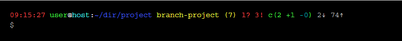
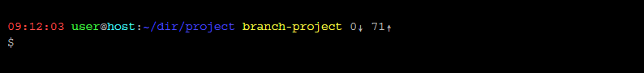
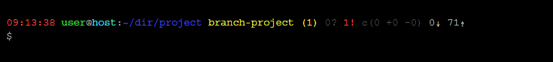

:MAIN_TITLE: Git Bash Workflow
:MAIN_TITLE_SHORT: GBW
:BASHRC_PATH: ~/.bashrc
:GBW_FILE: gbw.sh
:GBW_PATH: ~/git-bash-workflow/{GBW_FILE}
:GIT_PROJECT: https://github.com/jprivet-dev/git-bash-workflow

= {MAIN_TITLE}
:numbered:
:toc: macro

:toc-title: Summary
:toclevels: 3
toc::[]

'''

== Installation

In your shell, clone the project :

[source,shell]
[subs=attributes+]
----
cd
git clone {GIT_PROJECT}
----

Add to your `{BASHRC_PATH}` the following code :

[source,shell]
[subs=attributes+]
----
# If the file `{GBW_FILE}` exists, then load it
[[ -f {GBW_PATH} ]] && source {GBW_PATH}
----

Reload `{BASHRC_PATH}` with the following command (avoids logout and back to the shell) :

[source,shell]
[subs=attributes+]
----
. {BASHRC_PATH}
----

TADA ! *{MAIN_TITLE}* is ready

== Prompt with Git information

=== Presentation

:PROMPT_TIME:                   09:15:27
:PROMPT_USER_HOST:              user@host
:PROMPT_DIR:                    :~/dir/project
:PROMPT_BRANCH:                 branch-project
:PROMPT_COUNT_NB:               7
:PROMPT_COUNT:                  ({PROMPT_COUNT_NB})
:PROMPT_UNTRACKED_NB:           1
:PROMPT_UNTRACKED:              {PROMPT_UNTRACKED_NB}?
:PROMPT_NOT_STAGED_NB:          3
:PROMPT_NOT_STAGED:             {PROMPT_NOT_STAGED_NB}!
:PROMPT_TO_BE_COMMITTED_NB_1:   2
:PROMPT_TO_BE_COMMITTED_NB_2:   1
:PROMPT_TO_BE_COMMITTED_NB_3:   0
:PROMPT_TO_BE_COMMITTED:        c({PROMPT_TO_BE_COMMITTED_NB_1} +{PROMPT_TO_BE_COMMITTED_NB_2} -{PROMPT_TO_BE_COMMITTED_NB_3})
:PROMPT_BEHIND_NB:              2
:PROMPT_BEHIND:                 {PROMPT_BEHIND_NB}↓
:PROMPT_AHEAD_NB:               74
:PROMPT_AHEAD:                  {PROMPT_AHEAD_NB}↑
:PROMPT_PS1:                    {PROMPT_TIME} {PROMPT_USER_HOST}{PROMPT_DIR} {PROMPT_BRANCH} {PROMPT_COUNT} {PROMPT_UNTRACKED} {PROMPT_NOT_STAGED} {PROMPT_TO_BE_COMMITTED} {PROMPT_BEHIND} {PROMPT_AHEAD}
:PROMPT_PS1_NO_CHANGE:          09:12:03 user@host:~/dir/project branch-project 0↓ 71↑
:PROMPT_PS1_ONE_CHANGE:         09:13:38 user@host:~/dir/project branch-project (1) 0? 1! c(0 +0 -0) 0↓ 71↑

*{MAIN_TITLE}* changes the prompt (`PS1`) and adds information about Git :

{nbsp}

[cols="s,d", options="header"]
|===
2+| BASIC INFORMATION
| {PROMPT_TIME}               | current time
| {PROMPT_USER_HOST}          | current user & hostname
| {PROMPT_DIR}                | current working directory
|===

[cols="s,d", options="header"]
|===
2+| GIT INFORMATION
| {PROMPT_BRANCH}             | current branch
| {PROMPT_COUNT}              | *{PROMPT_COUNT_NB}* changes in total
| {PROMPT_UNTRACKED}          | *{PROMPT_UNTRACKED_NB}* untracked file
| {PROMPT_NOT_STAGED}         | *{PROMPT_NOT_STAGED_NB}* changes not staged for commit

| {PROMPT_TO_BE_COMMITTED}
| changes to be committed
(*{PROMPT_TO_BE_COMMITTED_NB_1}* = {PROMPT_TO_BE_COMMITTED_NB_1} modified
/ *+{PROMPT_TO_BE_COMMITTED_NB_2}* = {PROMPT_TO_BE_COMMITTED_NB_2} added
/ *-{PROMPT_TO_BE_COMMITTED_NB_3}* = {PROMPT_TO_BE_COMMITTED_NB_3} deleted)

| {PROMPT_BEHIND}             | *{PROMPT_BEHIND_NB}* commits behind branch of reference
| {PROMPT_AHEAD}              | *{PROMPT_AHEAD_NB}* commits ahead branch of reference
|===

=== Case examples

In *no change case*, you can see :

In *one change case*, you can see :

== Git aliases & hooks

=== Aliases

==== Alias activation and removal

Active all aliases configured by {MAIN_TITLE_SHORT} :

[source,shell]
[subs=attributes+]
----
$ gbw aliases [--global]
----

Remove all aliases configured by {MAIN_TITLE_SHORT}

[source,shell]
[subs=attributes+]
----
$ gbw aliases --unset [--global]
----

TIP: You can see all aliases in `--global` configuration file `~/.gitconfig`, or in the current repository configuration file `.git/config`

==== Alias list

[cols="1 s,2 d,1 d", options="header"]
|===
| Alias
| Raw command
| Description

| git b
| git branch
| List, create, or delete branches

| git c
| git commit -m
| Record changes to the repository with message

| git amend
| git commit -m --amend
| Change the last commit

| git undo
| git reset --soft HEAD^
| Undone last commit & changes are staged

| git k
| git checkout
| Switch branches

| git d
| git diff --function-context
| Show changes

| git l
| git log --graph --oneline --decorate --date=short --pretty=format:'%C(yellow)%h %C(cyan)[%ar] %C(green)<%<(9,trunc)%aN>%C(auto)%d %C(reset)%s' -12
| Show last 12 commit logs

| git ll
| git log --graph --oneline --decorate --date=short --pretty=format:'%C(yellow)%h %C(cyan)[%ar] %C(green)<%<(9,trunc)%aN>%C(auto)%d %C(reset)%s'
| Show commit logs

| git lcount
| git shortlog -sn
| Explain

| git rrr
| git clean -f -d; git reset --hard HEAD
| Explain

| git untracked
| git clean -f -d
| Explain

| git s
| git status -s
| Explain

| git ss
| git status
| Explain

| git sniffer
| git grep --break --heading --line-number --extended-regexp 'dump\\(\|console\\.[^(]+\\('
| Explain
|===

=== Hooks

==== Commits are documentation : `prepare-commit-msg`

TODO (Work in progress)

== Agile Git workflow commands

=== Workflow activation

TODO (Work in progress)

=== Workflow alias list

TODO (Work in progress)

[cols="s,d", options="header"]
|===
| Workflow alias
| Description

| git workflow
| Explain
|===
